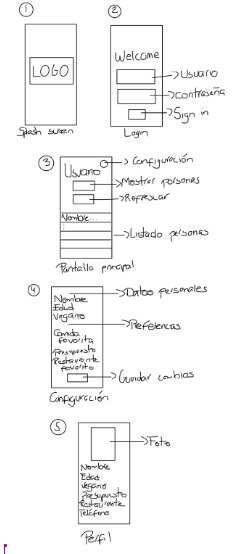
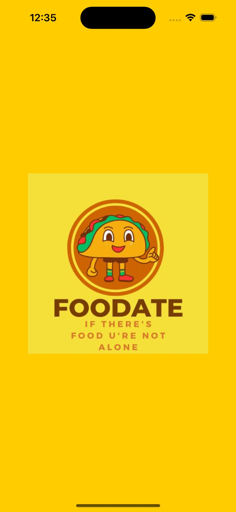
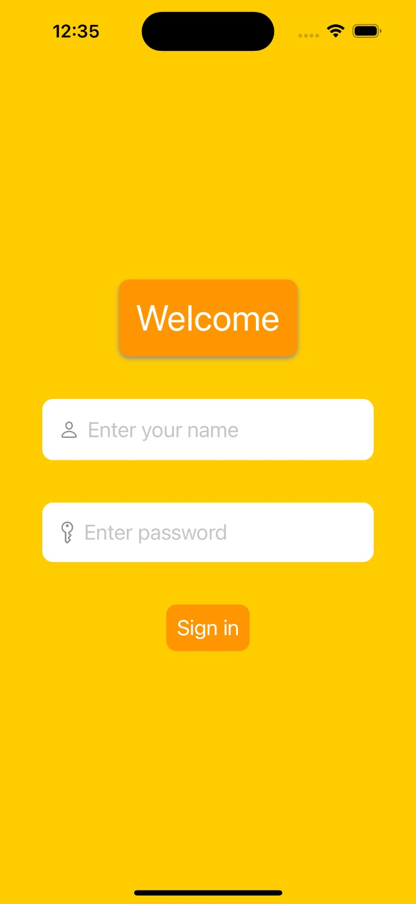
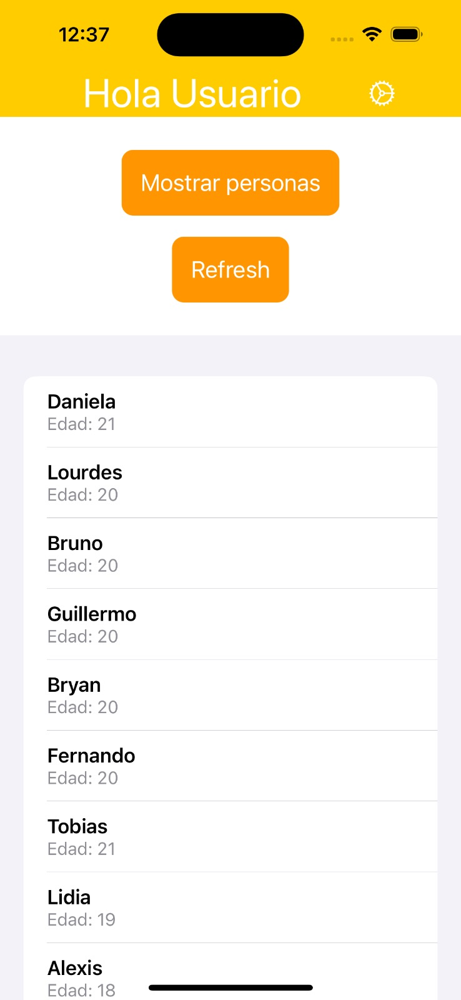
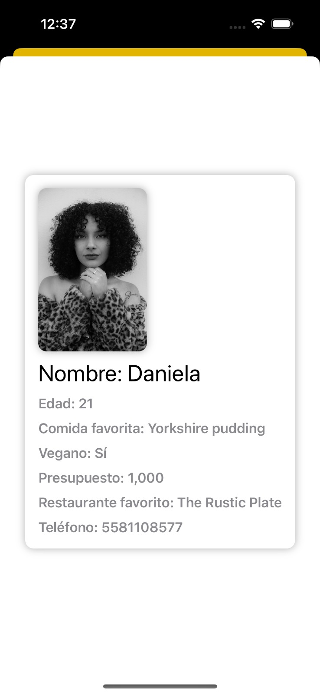
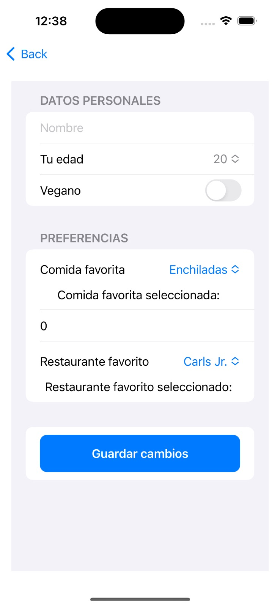

# Proyecto Final Desarrollo de Apps Móviles

 

 

 **Proyecto final**

**2023**

**FACULTAD DE INGENIERÍA**

**Desarrollo de aplicaciones para dispositivos inteligentes**

  

<table>
  <tr>
   <td rowspan="2" ><strong>ID</strong>
   </td>
   <td rowspan="2" ><strong>Nombre</strong>
   </td>
   <td rowspan="2" ><strong>Carrera</strong>
   </td>
  </tr>
  <tr>
  </tr>
  <tr>
   <td>0232263
   </td>
   <td>Fernanda Avalos Bermúdez
   </td>
   <td>Ingeniería en Inteligencia de Datos y ciberseguridad
   </td>
  </tr>
  <tr>
   <td>0234666
   </td>
   <td>Juan Manuel Pulido Moreno
   </td>
   <td>Ingeniería en Tecnologías de la Información
   </td>
  </tr>
  <tr>
   <td>0235320
   </td>
   <td>Esteban Viniegra Pérez Olagaray
   </td>
   <td>Ingeniería en Inteligencia de Datos y Ciberseguridad
   </td>
  </tr>
</table>

Diseño general de la aplicación:

    
    
    
    
    

Casos de uso:

Los casos de uso para esta aplicación de perfiles de personas basados en el rango de edad y preferencias gastronómicas podrían incluir:

* Descubrir restaurantes y platos nuevos: Los usuarios pueden explorar perfiles de personas dentro de su rango de edad y descubrir recomendaciones de restaurantes y platos que se ajusten a sus preferencias gastronómicas. Pueden explorar diferentes perfiles para tomar decisiones informadas sobre dónde comer y qué probar.
* Conectar con otros usuarios: Los usuarios pueden conectarse con otros usuarios que comparten sus mismas preferencias gastronómicas y rango de edad. Pueden intercambiar recomendaciones, compartir experiencias y planificar encuentros gastronómicos. Esta función fomenta la interacción social y permite establecer nuevas amistades o contactos en el ámbito culinario.
* Filtrar perfiles y recomendaciones: Los usuarios pueden utilizar filtros basados en su rango de edad para encontrar perfiles de personas que se ajusten a sus intereses específicos. Pueden basarse en las recomendaciones de restaurantes y platos para encontrar opciones que se ajusten a su presupuesto, ubicación y estilo culinario.

Investigación de mercado:

Esta aplicación de perfiles de personas basados en el rango de edad y preferencias gastronómicas resuelve el problema de encontrar opciones de restaurantes y platos que se ajusten a los gustos y necesidades específicas de cada usuario. En particular nos ayuda en los siguientes puntos:

* Descubrimiento de nuevos lugares y platos: La aplicación permite a los usuarios explorar perfiles de personas dentro de su rango de edad y descubrir recomendaciones de restaurantes y platos. Esto les ayuda a salir de su zona de confort culinaria y a descubrir nuevos lugares y sabores que de otra manera podrían haber pasado por alto.
* Conexión con otros usuarios: La aplicación fomenta la interacción social al permitir que los usuarios se conecten con personas que comparten sus mismas preferencias gastronómicas y rango de edad. Esto facilita la obtención de recomendaciones y consejos de personas con gustos similares, lo que enriquece la experiencia gastronómica y ayuda a descubrir nuevas opciones. 
* Información detallada de los perfiles de usuario: Los perfiles de usuario en la aplicación muestran información relevante como el nombre, edad, sexo, comidas favoritas, preferencias dietéticas y presupuesto. Esto ayuda a los usuarios a tener una idea clara de las preferencias de otros usuarios y facilita la toma de decisiones sobre dónde comer o qué plato probar.
* Ahorro de tiempo y esfuerzo: La aplicación agiliza el proceso de búsqueda y selección de restaurantes al proporcionar recomendaciones específicas y relevantes para cada usuario en base al rango de edad y posteriormente poder ver las preferencias de cada usuario y elegir en base a eso. 

Descripción del usuario ideal:

El usuario ideal para esta aplicación sería una persona activa en el ámbito gastronómico, con un interés genuino por descubrir nuevos restaurantes, platos y experiencias culinarias. Este usuario tiene las siguientes características:

* Amante de la comida: El usuario ideal disfruta de explorar diferentes sabores y está interesado en probar una amplia variedad de comidas y cocinas. Tanto los platos tradicionales como las propuestas más innovadoras captaron su interés.
* Orientado hacia la socialización: Este usuario valora la interacción social y desea compartir sus experiencias gastronómicas con otros. Está dispuesto a conectar con personas que compartan sus mismas preferencias y recibir recomendaciones de otros usuarios.
* Consciente de las preferencias dietéticas: El usuario ideal es consciente de las preferencias dietéticas, ya sea por razones de salud, éticas o medioambientales. Puede ser vegetariano, vegano u optar por una dieta específica, y busca opciones que se adapten a sus restricciones.
* Activo en redes sociales: Este usuario está familiarizado con el uso de redes sociales y le gusta compartir su vida y experiencias en línea. Está dispuesto a utilizar la aplicación para compartir recomendaciones, publicar reseñas y conectarse con otros usuarios a través de las redes sociales integradas.
* Explorador/a de restaurantes: El usuario ideal disfruta de la experiencia de ir a restaurantes y está dispuesto a probar nuevos lugares. Le interesa conocer los mejores restaurantes en su área y descubrir joyas ocultas recomendadas por otros usuarios.
* Conciencia del presupuesto: Si bien el usuario ideal valora la calidad de la comida, también es consciente de su presupuesto. Busca opciones que se ajusten a su rango de precios y aprecia recomendaciones que consideren la relación calidad-precio.